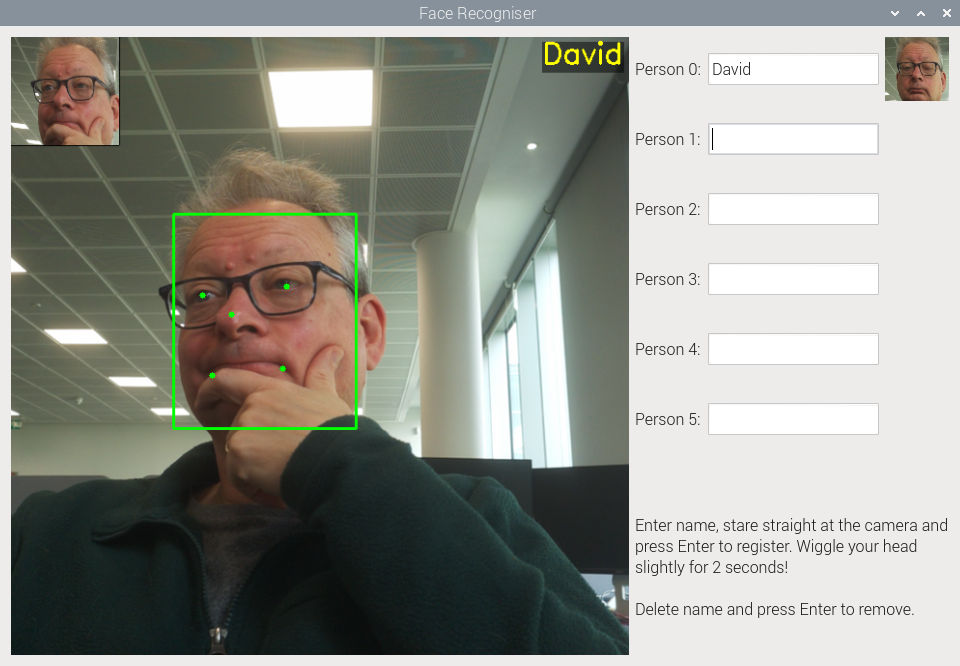

# Face Recognition Demo

A real-time face recognition application that uses the Raspberry Pi camera and Hailo AI accelerator to detect and recognize faces.



## Features

- Real-time face detection using SCRFD model
- Face recognition using ArcFace model
- Support for registering multiple faces
- Live preview with face annotations
- Simple and intuitive GUI interface

## Requirements

- Raspberry Pi 5 running the latest Raspberry Pi Desktop OS
- Raspberry Pi Camera Module
- Hailo AI Accelerator
- Required Python packages (see Installation section)

## Installation

1. First, install your Hailo AI Accelerator and check that it is working (if you haven't previously done so).

2. Next, install the required Python packages:
```bash
pip install tensorflow
pip uninstall numpy
pip install detection_tools
```
When creating a _venv_ in which to install these, don't forget to use `--system-site-packages` so that you pick up libcamera and Picamera2.

Note: The numpy uninstall is necessary because tensorflow may install a 2.x version of numpy, which won't work with Bookworm apt packages. We need to use the apt version.

3. Make sure you have the model files in your working directory. They were downloaded directly from the Hailo Model Zoo, and are maintained here just for convenience:
   - `scrfd_2.5g_8l.hef` (face detection model)
   - `arcface_mobilefacenet_8l.hef` (face recognition model)

## Usage

1. Run the demo:
```bash
python demo.py
```

2. The application window will open with:
   - Live camera preview on the left
   - Registration controls on the right

3. To register a new face:
   - Enter a name in one of the text boxes
   - Press Enter
   - Look straight at the camera
   - Slightly move your head for 2 seconds
   - Wait for the registration to complete

4. To remove a registered face:
   - Clear the name in the text box
   - Press Enter

5. The application will automatically:
   - Detect faces in real-time
   - Recognize registered faces
   - Display bounding boxes and names
   - Show facial landmarks

## License

This project is licensed under the BSD 2-clause license - see the LICENSE file for details.
